## Who am I?

I'm Harshil, an aerospace engineer with a deep passion for creating efficient and impactful software. Outside of engineering, I'm the maintainer of [python-telegram-bot](https://github.com/python-telegram-bot/python-telegram-bot), one of the most popular Python libraries for building Telegram bots.

Most of the code I ship is hand-written or, at the very least, carefully reviewed for correctness if done by AI. I typically end up rewriting large chunks of AI generated code. 

## Projects I'm currently working on ✍️

- [PinPointer](https://github.com/harshil21/PinPointer): This is my personal rocket, featuring many experimental technologies, with a high attention to detail. 
- Personal website and blog: This will most importantly look really good and showcase my work!

## Supporting me

If you like my work and want to support me, you can:

- BTC: 
- 

## Project Highlights

<a href="https://github.com/NCSU-High-Powered-Rocketry-Club/AirbrakesV2">
  <picture>
    <source srcset="profile/pin-AirbrakesV2-dark.svg" media="(prefers-color-scheme: dark)" />
    <source srcset="profile/pin-AirbrakesV2-light.svg" media="(prefers-color-scheme: light), (prefers-color-scheme: no-preference)" />
    
  </picture>
</a>
<a href="https://github.com/harshil21/carbonpy">
  <picture>
    <source srcset="profile/pin-carbonpy-dark.svg" media="(prefers-color-scheme: dark)" />
    <source srcset="profile/pin-carbonpy-light.svg" media="(prefers-color-scheme: light), (prefers-color-scheme: no-preference)" />
    
  </picture>
</a>
<a href="https://github.com/python-telegram-bot/python-telegram-bot">
  <picture>
    <source srcset="profile/pin-python-telegram-bot-dark.svg" media="(prefers-color-scheme: dark)" />
    <source srcset="profile/pin-python-telegram-bot-light.svg" media="(prefers-color-scheme: light), (prefers-color-scheme: no-preference)" />
    
  </picture>
</a>
<a href="https://github.com/harshil21/TGDates">
  <picture>
    <source srcset="profile/pin-TGDates-dark.svg" media="(prefers-color-scheme: dark)" />
    <source srcset="profile/pin-TGDates-light.svg" media="(prefers-color-scheme: light), (prefers-color-scheme: no-preference)" />
    
  </picture>
</a>
<a href="https://github.com/NCSU-High-Powered-Rocketry-Club/FIRM">
  <picture>
    <source srcset="profile/pin-FIRM-dark.svg" media="(prefers-color-scheme: dark)" />
    <source srcset="profile/pin-FIRM-light.svg" media="(prefers-color-scheme: light), (prefers-color-scheme: no-preference)" />
    
  </picture>
</a>
<a href="https://github.com/NCSU-High-Powered-Rocketry-Club/airbrakes-pi-hat">
  <picture>
    <source srcset="profile/pin-airbrakes-pi-hat-dark.svg" media="(prefers-color-scheme: dark)" />
    <source srcset="profile/pin-airbrakes-pi-hat-light.svg" media="(prefers-color-scheme: light), (prefers-color-scheme: no-preference)" />
    
  </picture>
</a>
<a href="https://github.com/harshil21/Aloft">
  <picture>
    <source srcset="profile/pin-Aloft-dark.svg" media="(prefers-color-scheme: dark)" />
    <source srcset="profile/pin-Aloft-light.svg" media="(prefers-color-scheme: light), (prefers-color-scheme: no-preference)" />
    
  </picture>
</a>

---

### 📊 GitHub Stats

<picture>
  <source srcset="profile/stats-dark.svg" media="(prefers-color-scheme: dark)" />
  <source srcset="profile/stats-light.svg" media="(prefers-color-scheme: light), (prefers-color-scheme: no-preference)" />
  
</picture>
<picture>
  <source srcset="profile/top-langs-dark.svg" media="(prefers-color-scheme: dark)" />
  <source srcset="profile/top-langs-light.svg" media="(prefers-color-scheme: light), (prefers-color-scheme: no-preference)" />
  
</picture>

